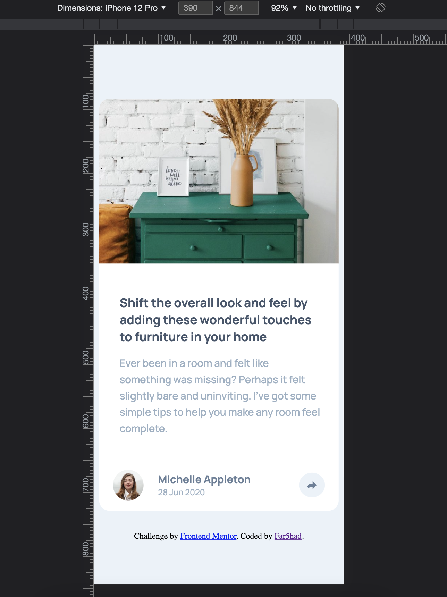

# Frontend Mentor - Article preview component solution

This is a solution to the [Article preview component challenge on Frontend Mentor](https://www.frontendmentor.io/challenges/article-preview-component-dYBN_pYFT). Frontend Mentor challenges help you improve your coding skills by building realistic projects. 

## Table of contents

- [Overview](#overview)
  - [The challenge](#the-challenge)
  - [Screenshot](#screenshot)
  - [Links](#links)
  - [Built with](#built-with)
- [Author](#author)

## Overview

### The challenge

Users should be able to:

- View the optimal layout depending on their device's screen size
- See hover and focus states for interactive elements

### Screenshot

### Links

- Solution URL: [Solution URL here](https://github.com/fa125had/article-preview-component)
- Live Site URL: [live site URL here](https://fa125had.github.io/article-preview-component/)

### Built with

- Semantic HTML5 markup
- CSS custom properties
- Flexbox
- Java Script

## Author

- GitHub - [Farshad](https://github.com/fa125had)
- Frontend Mentor - [@fa125had](https://www.frontendmentor.io/profile/fa125had)
